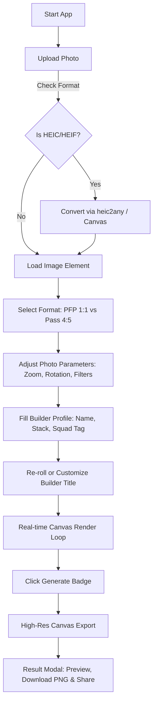

# 🌴 Hacker House Goa 2026 — Builder Pass & PFP Generator

> **Official Shortlisting Task Tool** for **Hacker House Goa 2026** (Oct 28–31, 2026).
> An interactive, high-performance web app that generates high-resolution, custom-branded **VIP Builder Passes (4:5)** and **PFP Avatar Frames (1:1)** directly in the browser with real-time HTML5 Canvas rendering.

---

## 🚀 Features at a Glance

- 📸 **Universal Image Compatibility**: Full support for JPG, PNG, WEBP, AVIF, GIF, and native iPhone **HEIC/HEIF** format conversion.
- 🎨 **Real-Time Canvas Compositing Engine**: Zero latency client-side rendering with sub-pixel image positioning, rotation, zoom, brightness, contrast, and color adjustments.
- 🏷️ **Smart Builder Title Generator**: Auto-detects tech stack keywords (AI/ML, Web3, Frontend, Backend, DevOps, Mobile, Design) to generate legendary titles with a **1-click Re-Roll engine**.
- 👥 **Squad Tag & Custom Metadata**: Embed custom team names, tech badges, unique Pass IDs, and security verification stamps into your builder badge.
- 📐 **Dual Format Support**:
  - **PFP Frame (1:1)**: Perfect overlay avatar frame tailored for X (Twitter), LinkedIn, and Discord.
  - **Builder Pass (4:5)**: VIP Event badge complete with dynamic vector branding, QR code, barcode, tech stack pills, and Goa tropical aesthetic.
- 🌴 **Cyber-Tropical Aesthetic**: Vibrant Neo-Brutalist green (`#005C31`), electric yellow (`#FFE600`), and tropical pink (`#FF007A`) design system featuring an animated floating Devanagari **"गोवा"** motif.
- 💾 **Instant Ultra-HD Export**: Export crisp 2000×2000px (PFP) or 1600×2000px (Pass) PNG files ready for download or social media sharing.

---

## 🛠️ System Architecture

The application runs purely client-side using React 18, Vite, TypeScript, and HTML5 Canvas to ensure maximum privacy, instant performance, and offline reliability.

```
                    ┌──────────────────────────────────────────────┐
                    │               User Input & Image             │
                    └──────────────────────┬───────────────────────┘
                                           │
                                           ▼
                    ┌──────────────────────────────────────────────┐
                    │  Photo Loader & HEIC Converter (heic2any)    │
                    └──────────────────────┬───────────────────────┘
                                           │
                                           ▼
                    ┌──────────────────────────────────────────────┐
                    │        Interactive Editor & Form State       │
                    │   (Zoom, Pan, Rotation, Brightness, Stack)   │
                    └──────────────────────┬───────────────────────┘
                                           │
                                           ▼
                    ┌──────────────────────────────────────────────┐
                    │     HTML5 Canvas Composite Engine            │
                    │   (Sub-pixel transforms, Vector overlays,    │
                    │    QR/Barcodes, Cyber-tropical Badge UI)     │
                    └──────────────────────┬───────────────────────┘
                                           │
                                           ▼
                    ┌──────────────────────────────────────────────┐
                    │          High-Res PNG Blob & Modal           │
                    │      (Instant Download & Social Sharing)     │
                    └──────────────────────────────────────────────┘
```

---

## 🔄 Application Flow Diagram



---

## 📦 Project Structure

```text
├── src/
│   ├── components/
│   │   ├── BackgroundDecorations.tsx   # Atmospheric cyber-grid & palm background
│   │   ├── BuilderForm.tsx             # Interactive profile form & title re-roller
│   │   ├── CanvasEditor.tsx            # Live canvas preview & transform controls
│   │   ├── FormatPicker.tsx            # Toggle between PFP Frame (1:1) & VIP Pass (4:5)
│   │   ├── HeaderNav.tsx               # Top branding header navigation bar
│   │   ├── PhotoUploader.tsx           # Drag-and-drop universal file uploader
│   │   └── ResultModal.tsx             # Full-screen output preview & download modal
│   ├── utils/
│   │   ├── builderTitles.ts            # Smart title generator & title pools
│   │   ├── canvasRenderer.ts           # Ultra-precision HTML5 Canvas rendering engine
│   │   └── heicConverter.ts            # HEIC image conversion helper
│   ├── types.ts                        # Shared TypeScript interfaces & types
│   ├── App.tsx                         # Main application layout & state coordinator
│   ├── main.tsx                        # React DOM entry point
│   └── index.css                       # Global Tailwind CSS imports & custom fonts
├── public/                             # Static assets
├── package.json                        # Project dependencies & build scripts
├── vite.config.ts                      # Vite configuration
└── README.md                           # Project documentation
```

---

## 🧰 Tech Stack

- **Framework**: [React 18](https://react.dev/) + [TypeScript](https://www.typescriptlang.org/)
- **Build Tool**: [Vite](https://vitejs.dev/)
- **Styling**: [Tailwind CSS v4](https://tailwindcss.com/)
- **Animations**: [Motion](https://motion.dev/) (`motion/react`)
- **Icons**: [Lucide React](https://lucide.dev/)
- **Image Processing**: Custom HTML5 2D Context Pipeline + `heic2any`

---

## ⚡ Quick Start & Development

### 1. Prerequisites
Ensure you have Node.js 18.x or higher installed.

### 2. Clone Repository
```bash
git clone https://github.com/your-username/hh-goa-2026-badge.git
cd hh-goa-2026-badge
```

### 3. Install Dependencies
```bash
npm install
```

### 4. Run Development Server
```bash
npm run dev
```
Open [http://localhost:3000](http://localhost:3000) in your browser to view the app.

### 5. Build for Production
```bash
npm run build
```
The optimized production bundle will be created in the `dist/` directory.

---

## 📄 License

Created for the **Hacker House Goa 2026** shortlisting challenge.
Feel free to fork, customize, and share! 🌴⚡
